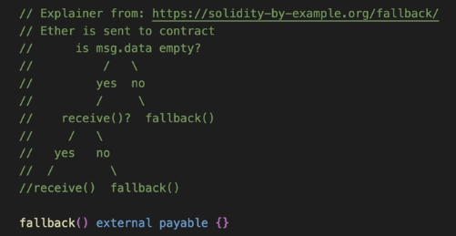

## Tooling and Environment

- VS Code has a lot of greate extensions to support working with Solidity and Security and Auditing
- Have only used the Foundry framework and will continue to use it because it is awesome
- If using, install WSL to be able to use Linux commands
- Phind.com - will search the internet
- ChatGPT
- Peeranha.io
- Ethereum Stack Exchange

## Fuzzing and Invariants

- Foundry allows us to carry out fuzz testing and stateful fuzzing - A.K.A as invariant testing in Foundry
- Fuzzing allows us to pass random data to our system in an attempt to break it but does not store where it got to in the state before running the next fuzz
- Stateful fuzzing tracks where we are with changes to the state of our system and uses that to tailor what inputs are passed in the next stateful fuzz test. It will call random functions and pass random values and we can control what contracts to test or even design functions in a Helper file that we can use to create scenarios for our invariant tests to use before evaluating the invariant we are trying to break
- stateful fuzzing/invariant testing is trying to break invariants - statements that should always be the case, regardless of what happens - e.g X should always be greater than 1, regardless of any interactions with our system (functions and change to variables), should only be 1 winner in a raffle

## ERC20 and ERC721

- ERC20 is an ethereum token standard
  - govenance tokens
  - can be used to secure an underlying network
  - create a synthetic assess
  - just about anything else
  - There are other standard that have been made post ERC20 that are compatible with ERC20, like ERC677, ERC777
- ERC721 is an ethereum NFT standard - token standard for non-fungible tokens
  - each token is unique and is not interchangeable with each other - e.g pokemon, art, trading card
  - can be used for games and gaming - stats, characteristics
  - each token id represents a unique asset
  - we can use metadat to define the characteristics of each nft and we can store metadata in the blockchain or off the blockchain (IPFS) using token URIs for example

## Storage

- storage variables take up storage slots (slot 0, slot 1, slot 2, etc)
- Constant and immutable variables in Solidity won't show up instorage because they are part of the bytecode of the smart contract
- We can use 'forge inspect CONTRACT_NAME storage' to inspect the storage layout of the supplied contract
- Each storage slot is 32 bytes long
- Each storage variable gets assigned to simply the next available storage slot
- Values in storage are in Hex value at lower-level to be processed further by EVM
- dynamic values, like mappings and dynamic arrays are stored using a hashing function - these are shown in solidity docs, basically the hashed value is the storage slot that each variable of dynamic structure goes to
  - For dynamic arrays, a sequential storage slot is taken up for th elength of the array
  - for mappings, a sequential storage slot is taken up but is left blank
- variables defined inside of functions are not written to storage, instead they are in a different memory structure that gets deleted after the function is fisnished running
- string are technically dynamic sized arrays and can be expensive, solidity enforces us to say whether the variable needs to be written to storage and account for those storage slots or to do use them in temporary memory

## Fallback and Receive functions

- functions in soldity be default will reject and revert if ether is sent with the transaction calling the function, UNLESS we specify that the function is 'payable'
- transaction to just transfer ether, no calldata provided (not calling a function or anything) demo of what occurs
  - 
- Contracts that do not have defined receive and fallback functions cannot accept native Eth

## Self-Destruct

- contracts can be deleted from the blockchain by calling selfdestruct
- selfdestruct sends all remaining ether stored in the contract to a desingated address
- if an address has no recieve or fallback function, you can't send ether UNLESS you use selfdestruct
  - an attacker could try and leverage an exploit by bruteforcing the sending of eth to another smart contract that allows further malicious activity because that address now has unexpected ether