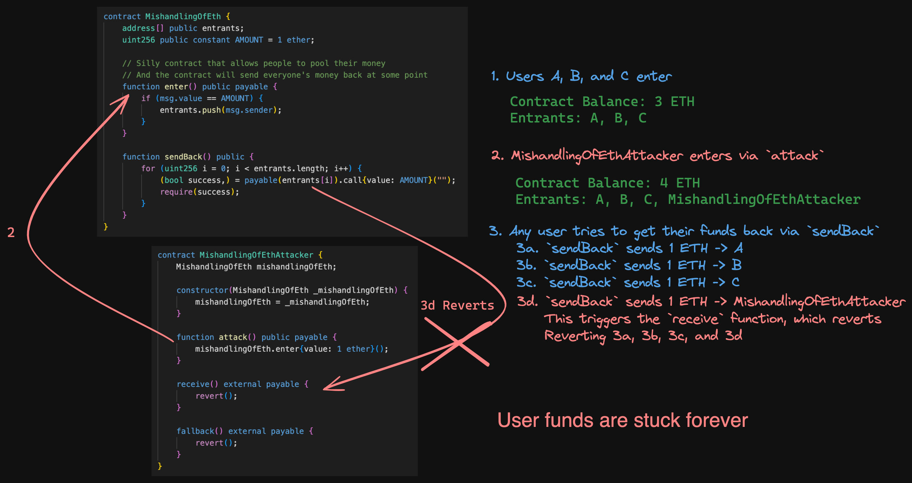

## Mishandling of ETH

This is a very broad area and there are many scenarios that can catch you out that you need to be aware of.

For example, if a smart contraact has payable functions, but does not have receive() or fallback() functions, then the smart contract must be able to very accurately track the amount of ETH sent to it through those functions for different purposes. Failure to do this can result in loss of ETH, weird scenarios that prevent functionality, incorrect paymount amounts, even causing a contract to become vulnerbale to malicious selfdestruct!

### The Selfdestrcut function and its Quirks

The EVM `selfdestruct()` function is a special function that can exist in a smart contract and when that smart contract calls the `selfdestruct()` function, it will cause the contract to be destroyed - however, when doing this it is able to send ETH to any address that is passed in as a paramter, regardless of whether or not the contract is payable.

```solidity

selfdestruct(payable(address(target)));

```
If a protocol uses variables to track the total amount of ETH and needs to do exact matching to the balance of the contract for certain functionality to occur, there is immediate concerns arising if there is no way to restore equalibirum of the two if a malicious attack occurs.

For example, if the protocol only has payable functions and a tracking variable, and this tracking variable needs to equal the remaining ETH balance to execute functions or else it can't operate correctly, possibly even breaking the protocol. An attacker could use the `selfdestruct()` function to send ETH to the protocol to deliberately cause a mismatch between the ETH balance of the contract and the tracking variable. Rendering the function that requires exact amount tracking unable to execute, locking in ETH and possibly breaking the protocol and causing a denial of service.

```solidity
// SPDX-License-Identifier: MIT

// @notice - TheUser1935 - I took this from the sc-exploits-minimized repo of Cyfrin: https://github.com/Cyfrin/sc-exploits-minimized/tree/main?tab=readme-ov-file

pragma solidity 0.8.20;

contract SelfDestructMe {
    uint256 public totalDeposits;
    mapping(address => uint256) public deposits;

    function deposit() external payable {
        deposits[msg.sender] += msg.value;
        totalDeposits += msg.value;
    }

    function withdraw() external {
        assert(address(this).balance == totalDeposits); // bad
        uint256 amount = deposits[msg.sender];
        totalDeposits -= amount;
        deposits[msg.sender] = 0;

        payable(msg.sender).transfer(amount);
    }
}

contract AttackSelfDestructMe {
    SelfDestructMe target;

    constructor(SelfDestructMe _target) payable {
        target = _target;
    }

    function attack() external payable {
        // Force the sending of ETH to target address to break the assert in withdraw function of SelfDestructMe
        selfdestruct(payable(address(target))); 
    }
}
```

### The Pull over Push for payments problem that can arise with mishandling of ETH

To open the discussion I want to include 2 quotes from [makoto_inoue's article - A SmartContract best practice: Push, Pull, or Give?](https://medium.com/noblocknoparty/a-smartcontract-best-practice-push-pull-or-give-b2e8428e032a)

> *Every Ether transfer implies potential code execution. The receiving address can implement a fallback function that can throw an error. Thus, we should never trust that a send call will execute without error. A solution: our contracts should favor pull over push for payments.*

> *External calls can fail accidentally or deliberately. To minimize the damage caused by such failures, it is often better to isolate each external call into its own transaction that can be initiated by the recipient of the call. This is especially relevant for payments, where it is better to let users withdraw funds rather than push funds to them automatically. (This also reduces the chance of problems with the gas limit.) Avoid combining multiple send() calls in a single transaction*


**What does this mean?**

Well, lets imagine that we had a smart contract that took payments of ETH in and we stored ALL the addresses of the users who sent ETH to us in an array so that we could execute some logic or functionality, and at the end of carrying out what we needed to do we can sedn back everyone's ETH that they sent.

**How do we do this?**

Well, the most logical and straightforward answer is that we can loop through the array of each address and then simply use the `call{value: XX}("")` function to send ETH to the address. This is what we call the `push` method of payment - we are pushing the payment to the address.

**What's wwong with that?**

Well, as we have covered off on in previous sections, if the address that deposited some ETH and is being sent ETH back is a smart contract then there is risk of unexpected code execution.

We covered off on how we can carry out reentrancy by designing a malicious `receive()` or `fallback()` function by calling the same function or another function upon recieivng ETH.

But there is also another problem that can arise with this, beyond calling another function - *simply reverting*

**The Push method Exploit - reverting**

If we are looping through an array of addresses to **push** payments to and we encounter an address of a smart contract that immediately reverts because it can't accept payments, or its had the `receive()` or `fallback()` designed to immediately revert upon receiving ETH - *we will revert the ENTIRE transaction of the function that was sending ETH back to people.*

The attacker can cause ALL ETH of the contract to be locked with no way of users being able to get their payments!



**So what is the pull method?**

The pull method is to move away from attempting to push payments to users, and instead design the protocol in such a way that users can `pull` the payment from the smart contract to themselves in their own time.

It is important to still remember the quotes from the beginning of this section though, and the snippet "*Every Ether transfer implies potential code execution*" is something that should be a pinned thought that lingers in the back of your mind, changing how you think forever about payments. This is because we can't just forget about other vulnerabilities that can arise with payments - ensure that we use the Checks, Effects, Interactions (CEI) approach in functions and nonreentrant logic to ensure that malicious users can't manipulate another area after we fix this one. 

### Mishandling of Eth Case Study - SushiSwap

For this case study, we look at the article [samczun - Two Rights Might Make A Wrong](https://samczsun.com/two-rights-might-make-a-wrong/) where samczun found a vulnerability in the SushiSwap MISO platform that jeopardised ~350 million USD worth of ETH at the time. It is a really intersting and unique finding that can seem a littel too conceptual at the start and hard to think about, but really should be aware of because it can happen again.

The MISO platforms operates two types of auctions: Dutch auctions and batch auctions.

The protocol featured a function called `batch` which allowed multiple transactions to occur in a single transaction by looping through calldata and using the special function `delegatecall()` which we have spoken about before.

samczun found that inside the delegate call, `msg.sender` and `msg.value` were persisted. And this meant that an attacker could batch multiple calls that called other functions that used `msg.sender` as part of its logic and it would re-use the original `msg.value` amount of ETH across every transaction, allowing the attacker to bid in the active Dutch auction going on for free. Essentially an attacker could send 1 ETH and be able to make 100 calls instead of being limited by the requirement of ETH per transaction.

To really make it clear, the `msg.value` always remained constant and used in every batch call because of looping. 

The protocol would track the amount of ETH sent in by the user in the `commitEth` function, which is where the batch function with its looping really begins to shine in how bad this can get. See its one thing to allow a user to execute calls for free, but it would be a whole other issue if other user funds could be at risk.

Well, it turns out they were. smczun found some refund logic that would allow the removal of ETH from the contract. What he found was
> *... a refund would be issued for any ETH sent which went over the auction’s hard cap. This applied even once the hard cap was hit, meaning that instead of rejecting the transaction altogether, the contract would simply refund all of your ETH instead*.
>
>*Suddenly, my little vulnerability just got a lot bigger. I wasn’t dealing with a bug that would let you outbid other participants. I was looking at a 350 million dollar bug.* 

This is because of the fact that `msg.value` remained persitant and an attacker could simply recursively do batch transactions to increase the amount of perceived ETH deposited by the attacker until forcing a refund transaction to occur that would drain all of the ETH that others have deposited because it was not correctly tracked of how much they had deposited and other controls. An attacker could have spent 1 ETH to take 140,000 ETH out of the contract worth ~350 million USD at the time.

I really appreciate the reflection posted in regards to handling `msg.value`:
>*First, using msg.value in complex systems is hard. It’s a global variable that you can’t change and persists across delegate calls. If you use msg.value to check that payment was received, you absolutely cannot place that logic in a loop. As a codebase grows in complexity, it’s easy to lose track of where that happens and accidentally loop something in the wrong place. Although wrapping and unwrapping of ETH is annoying and introduces extra steps, the unified interface between WETH and other ERC20 tokens might be well worth the cost if it means avoiding something like this*


***I highly reccomend reading the article because it extends past covering the vulnerability into the disclosure and follow on actions, as well as reflections - it is very interesting***