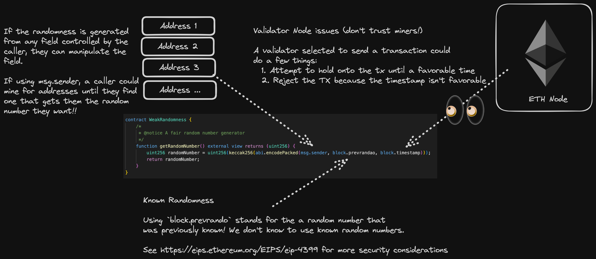

## Weak Randomness

The blockchain is deterministic in nature and therefore, using anything on the blockchain for randomess is inherently flawed. Miner nodes influencing things through to getting the 'random' value in the same block causing an easy way of using that number, there are many weird and strange ways using the blockchain for randomness can result in something that is not random, which can jeopardise entire protocols.

### Weak Randomness Mitigation

Getting a random number off-chain using a decentralised Oracle (VRF) like Chainlink VRF, or using a Commit Reveal Scheme.

Chainlink VRF features cryptographic proof of work that it is a random number that has been generated and their docs are [here](https://docs.chain.link/vrf) are an awesome resource and can get you up and running quickly.

### Weak Randomness Case Study - Meebits NFT with Andy Li (Aussie) from Sigma Prime

- Meebits NFT created by team beind CryptoPunks
- Premise was that anybody who owned a CryptoPunks NFT was able to mint a free Meebits NFT
- Attributes of each NFT were meant to be random and certain traits were more valuable than others
- Hacker exploied the Meebits smart contract in May 2021 by 're-rolling their randomness'
- This resulted in the hacker minting a rare NFT which they sold for 700K

#### How the attack happened

1. Metadata Disclosure
   1. Attacker was able to access the metadata of traits which showed which traits were more rare and valuable than others
   2. The smart contract disclosed a link to IPFS hash that contained the meebits metadata on line 129 of the smart contract. 
   3. The JSON inside of the metadata detailed what aspects of the NFT are the most rare - pointing out the order of most rare traits to least rare traits
   4. More information about rarity could be found on the Meebits website using the `tokenURI` function where you just needed to put in your token ID and the URL would tell you about the rarity of that tokenID
   5. This meant you could check the rarity of any NFT in the collection based upon a tokenID
2. Insecure Randomness
   1. Smart contract generated weak randonmness that allowed the attacker to reroll their mint until the one they wanted to recieve
   2. The `mintWithPunkOrGlyph` function was external and took in a `uint` number that represented tokenId of a CryptoPunk or Glyph NFT and would return a `uint` value. It would check to see if you were the owner of that NFT with that tokenID
   3. After passing the checks, it then called an internal `_mint` function using that `uint` value (which will also return a `uint`)
   4. The `uint` number to be returned was named `id` and was generated by calling the `randomIndex()` function
   5. It would then assign the NFT with that ID to the address of the minter (owner of a CryptoPunk or Glyph NFT)
3. Attacker repeatedly Reroll the Mint
   1. The attacker deployed a smart contract that would repeatedly call the `mintWithPunkOrGlyph` function until they received the ID they wanted
   2. The contract had an assert statement that would check if the ID they wanted was the ID they received and if it was not, it would revert the transaction
   3. The smart contract would then try again, and again and again
4. Received rare NFT
   1. After 6 hours of repeated calls later, and thousand and thousands worth of dollars on Gas
   2. Rare meebit #16647 was minted which was the second most rare trait in the NFT collection